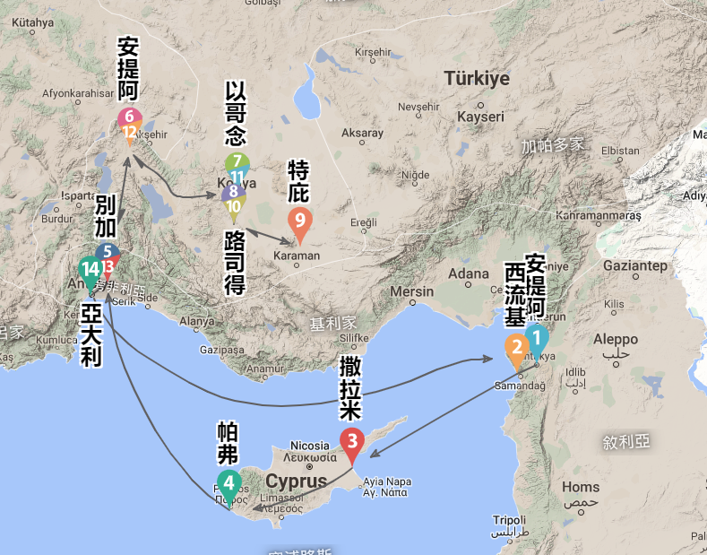
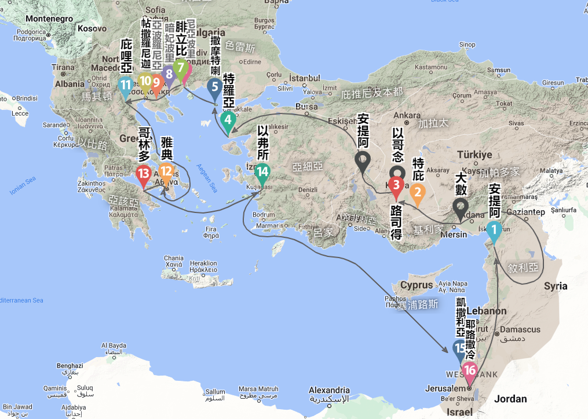
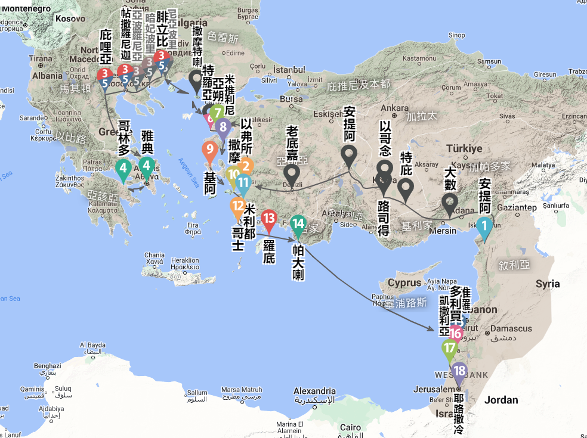

# 使徒行传

## 大纲

- 第1章 
  - 赐圣灵的应许
  - 耶稣升天
  - 门徒们聚集同心祷告
  - 补选使徒
- 第2章 
  - 圣灵降临
  - 彼得在五旬节的讲道
  - 三千人受洗
  - 信徒的共享生活
- 第3章 
  - 彼得医好瘸腿的人
  - 彼得在所罗门廊下的讲道
- 第4章 
  - 彼得和约翰在公会受审
  - 二使徒获释
  - 门徒求主赐胆量
  - 凡物公用
- 第5章 
  - 亚拿尼亚和撒非喇
  - 使徒大行神迹奇事
  - 使徒受迫害
- 第6章 
  - 拣选七执事
  - 司提反被捕
- 第7章 
  - 司提反当众申诉
  - 司提反殉道
- 第8章 
  - 扫罗迫害教会
  - 福音传到撒玛利亚
  - 埃塞俄比亚太监受洗归主
- 第9章 
  - 扫罗在大马士革传道
  - 逃脱犹太人的谋害
  - 扫罗在耶路撒冷
  - 以尼雅得医治
  - 多加复活
- 第10章 
  - 哥尼流得指示请彼得
  - 彼得见异象
  - 在哥尼流家中讲道
  - 外邦人领受圣灵
- 第11章 
  - 向耶路撒冷教会报告
  - 安提阿的教会
- 第12章 
  - 雅各和彼得遭受迫害
  - 彼得获救出狱
  - 希律亚基帕的死
- 第13章 
  - 巴拿巴和扫罗奉差遣
  - 在塞浦路斯传道
  - 在彼西底的安提阿传道
- 第14章 
  - 在以哥念传道
  - 在路司得传道
  - 回到叙利亚的安提阿
- 第15章 
  - 耶路撒冷会议
  - 致外邦信徒的信
  - 保罗和巴拿巴分开
- 第16章 
  - 提摩太跟保罗、西拉同工
  - 马其顿的呼声
  - 吕底亚归主
  - 在腓立比被囚
- 第17章 
  - 帖撒罗尼迦的骚动
  - 使徒们在庇哩亚传道
  - 保罗在雅典
- 第18章 
  - 保罗在哥林多
  - 保罗回到安提阿
  - 亚波罗在以弗所讲道
- 第19章 
  - 保罗在以弗所
  - 士基瓦的儿子们
  - 以弗所的骚乱
- 第20章 
  - 保罗重访马其顿和希腊
  - 保罗最后一次访问特罗亚
  - 从特罗亚到米利都
  - 对以弗所长老的临别赠言
- 第21章 
  - 保罗上耶路撒冷
  - 保罗访问雅各
  - 保罗在圣殿里被捕
  - 保罗为自己辩护
- 第22章 
  - 保罗奉召向外邦人传道
  - 保罗与官长交涉
  - 保罗在公会前申诉
- 第23章 
  - 杀害保罗的阴谋
  - 保罗被解交腓力斯巡抚
- 第24章 
  - 犹太人控告保罗
  - 保罗为自己辩护
  - 腓力斯留保罗在监里
- 第25章 
  - 保罗要向凯撒上诉
  - 被带到亚基帕王面前
- 第26章 
  - 保罗在亚基帕王面前申辩
  - 向犹太人和外邦人作见证
  - 保罗恳请亚基帕信主
- 第27章 
  - 保罗被用船送往罗马
  - 海上的风暴
  - 船搁浅
- 第28章 
  - 保罗在马耳他岛上
  - 保罗抵达罗马
  - 保罗在罗马传道

## 彼得和保罗所行的神迹

| **彼得**   |  |
| -------- | -------- |
| 徒3:1-11  | 医治一个生来瘸腿的人 |
| 5:15-16  | 彼得的影儿医治人 |
| 5:17     | 行神迹招致犹太人的忌恨 |
| 8:9-24   | 处理行邪术的西门 |
| 9:33-34  | 医治瘫子以尼雅 |
| 9:36-41  | 使多加复活 |
| **保罗**   |  |
| 14:8-18  | 医治一个生来瘸腿的人 |
| 19:11-12 | 保罗的手巾和围裙医治人 |
| 13:45    | 行神迹招致犹太人的忌恨 |
| 13:6-11  | 处理行邪术的巴耶稣 |
| 20:9-12  | 使犹推古复活 |

## 使徒行传中的讲章和讲论

| **发言人 彼得/保罗/其他人** | **场合和/或听众**                        | **城市**           | **参考经文**       |
| -------------------- | ---------------------------------- | ---------------- | -------------- |
| 彼得                   | 拣选人承继犹大的使徒位分                       | 耶路撒冷             | 1:16-22        |
| 彼得                   | 五旬节那日的奇迹                           | 耶路撒冷             | 2:14-36        |
| 彼得                   | 在圣殿里医治一个瘸腿的人                       | 耶路撒冷             | 3:12-26        |
| 彼得                   | 在公会面前传讲基督复活                        | 耶路撒冷             | 4:8-12         |
| 迦玛列                  | 在公会面前谈及彼得和其他人                      | 耶路撒冷             | 5:35-39        |
| 司提反                  | 被捕后在公会面前                           | 耶路撒冷             | 7:2-53         |
| 彼得                   | 在哥尼流家里向外邦人传福音                      | 凯撒利亚             | 10:34-43       |
| 彼得                   | 向教会辩解在凯撒利亚所发生的事情                   | 耶路撒冷             | 11:4-17        |
| 保罗                   | 安息日在犹太人的会堂中讲道                      | 彼西底的安提阿          | 13:16-41       |
| 保罗和巴拿巴               | 面对想要拜他们的群众                         | 路司得              | 14:15-17       |
| 彼得                   | 教会会议上                              | 耶路撒冷             | 15:7-11        |
| 雅各                   | 教会会议上                              | 耶路撒冷             | 15:13-21       |
| 保罗                   | 在马尔斯山（Mar’s Hill；译注：又名“亚略巴古”）上的雅典人 | 雅典               | 17:22-31       |
| 底米丢                  | 因保罗讲道而骚乱的银匠                        | 以弗所              | 19:25-27       |
| 城的书记                 | 在以弗所城骚动时                           | 以弗所              | 19:35-40       |
| 保罗                   | 在以弗所教会长老聚集时                        | 米利都              | 20:18-35       |
| 保罗                   | 面对想杀害保罗的暴民                         | 耶路撒冷             | 22:1-21        |
| 保罗                   | 在公会面前辩护                            | 耶路撒冷             | 23:1-6         |
| 保罗                   | 在腓力斯面前辩护                           | 凯撒利亚             | 24:10-21       |
| 保罗                   | 在非斯都面前辩护                           | 凯撒利亚             | 25:8、10-11     |
| 保罗                   | 在希律亚基帕二世面前辩护                       | 凯撒利亚             | 26:1-23        |
| 保罗                   | 面对在暴风中同船的人                         | 地中海克里特与 马耳他之间 | 27:21-26       |
| 保罗                   | 向犹太领袖作证                            | 罗马               | 28:17-20、25-28 |

## 保罗第一次宣教旅程
<https://bibleeveryone.com/paul-trip1.php>

## 保罗第二次宣教旅程
<https://bibleeveryone.com/paul-trip2.php>

## 保罗第三次宣教旅程
<https://bibleeveryone.com/paul-trip3.php>

保罗第三次传道旅程摘要
